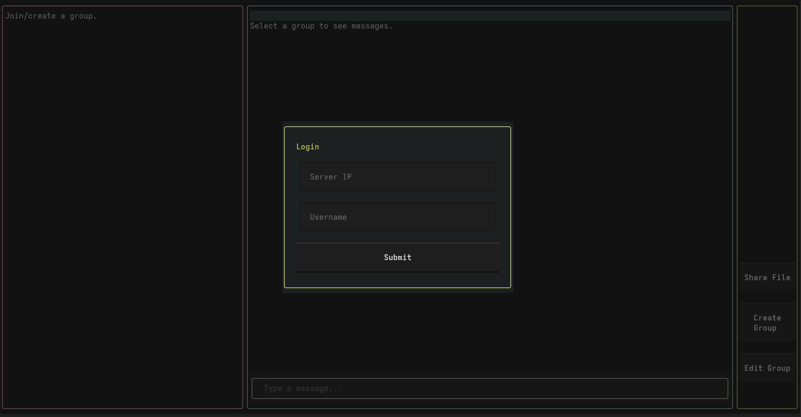

# CSC3002F Networking Project — Messaging App

A terminal-based messaging application built with Python and [Textual](https://textual.textualize.io/).



## Features

- Real time messaging
- Group chats

## Setup

### 1. Clone this repository
```shell
git clone https://github.com/SFBdragon/net-chat-proj
```

### 2. Enter the repo directory
```shell
cd net-chat-proj
```

### 3. Install `uv`

This project uses [`uv`](https://docs.astral.sh/uv/), an extremely fast Python package and project manager written in Rust.

Install it here: [https://docs.astral.sh/uv/getting-started/installation](https://docs.astral.sh/uv/getting-started/installation)

### 4. Set up the environment

```shell
uv venv
```

Dependencies are declared in `pyproject.toml` and will be picked up automatically by `uv run`.
Use `uv add <package-name>` to install new packages.

## Running

Start the server:
```shell
uv run src/server.py
```

Start the client:
```shell
uv run src/client.py
```

## WIP

These features currently do not work, but are planned to be completed in the near future:
- Edit groups
- Share files

Not that the application is still being tested - some features may not work as expected.

## Usage

1. On launch, a login modal will appear; enter the **server IP** and a **username** to connect.
2. Use the arrow keys to navigate between panes (groups on the left, messages in the centre, actions on the right).
3. Press **Enter** in the message pane to send a message.
4. Use the action pane to **create groups**

### Keyboard Navigation

| Key      | Action                             |
| -------- | ---------------------------------- |
| `←`/`→`  | Switch between panes               |
| `↑`/`↓`  | Navigate groups or scroll messages |
| `Enter`  | Send message                       |
| `Tab`    | Cycle focus within a modal         |
| `Escape` | Dismiss action modals              |

## Project Structure

```
net-chat-proj/
├── src/
│   ├── app.py
│   ├── client.py
│   ├── server.py
│   ├── db.py
│   └── ...
├── styles/
├── pyproject.toml
└── README.md
```
